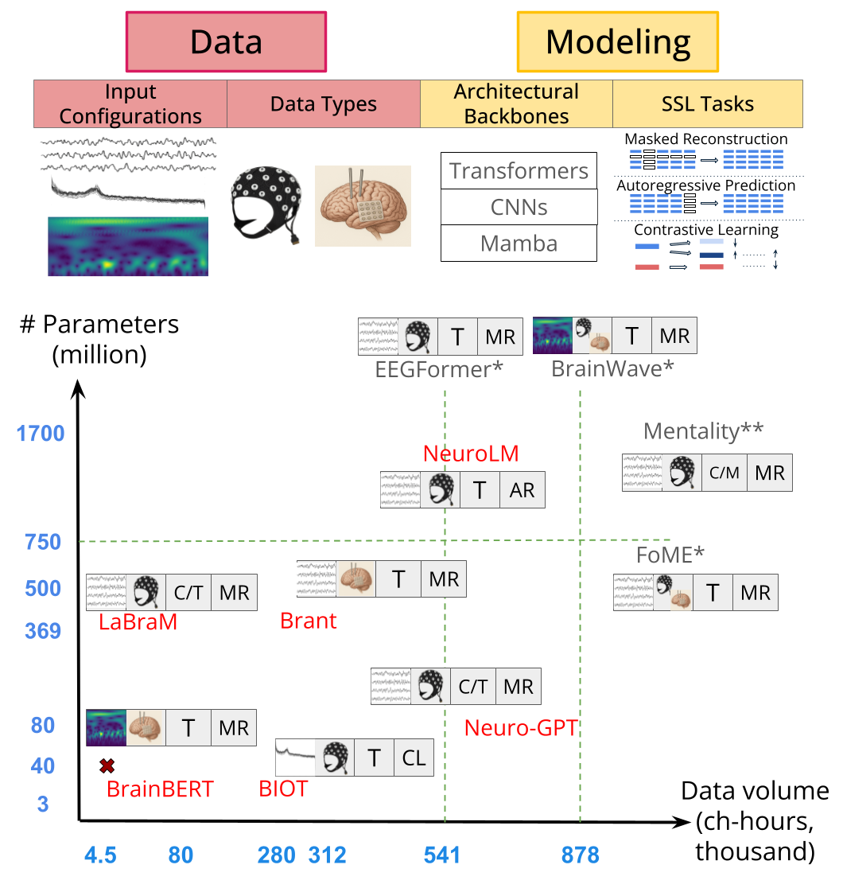

# EEG Foundation Models: A Critical Review of Current Progress and Future Directions

- **Full Paper:** [arXiv](https://arxiv.org/pdf/2507.11783)
- **Workshop Paper:** [NeurIPS 2025 Brain and Body Foundation Models Workshop](https://openreview.net/pdf?id=Iu6qVgtgUD)

---

## Visual Summary



---

# EEG Foundation Models

# *2024*

- **EEGFormer: Towards Transferable and Interpretable Large-Scale EEG Foundation Model** (2024)<br>
*AAAI Spring Symposium (2024)* <br>
Yuqi Chen, Kan Ren, Kaitao Song, Yansen Wang, Yifan Wang, Dongsheng Li, Lili Qiu <br>
[[Paper]](https://openreview.net/forum?id=MXRy6bYBfB)

- **Large Brain Model for Learning Generic Representations with Tremendous EEG Data in BCI** (2024)<br>
*ICLR (2024)* <br>
Wei-Bang Jiang, Li-Ming Zhao,  & Bao-Liang Lu <br>
[[Paper]](https://arxiv.org/pdf/2405.18765)
[[Code]](https://github.com/935963004/LaBraM)

- **Mentality: A Mamba-based Approach towards Foundation Models for EEG** (2024)<br>
*ICLR Workshop TS4H (2024)* <br>
Saarang Panchavati, Corey Arnold,  William Speier <br>
[[Paper]](https://openreview.net/pdf?id=O6T38rRiFp)

- **NeuroLM: A Universal Multi-task Foundation Model for Bridging the Gap between Language and EEG Signals** (2024)<br>
*ICLR (2025)* <br>
Wei-Bang Jiang, Yansen Wang, Bao-Liang Lu, Dongsheng Li <br>
[[Paper]](https://arxiv.org/pdf/2409.00101)
[[Code]](https://github.com/935963004/NeuroLM)

- **FoME: A Foundation Model for EEG using Adaptive Temporal-Lateral Attention Scaling** (2024)<br>
*Arxiv* <br>
Enze Shi, Kui Zhao, Qilong Yuan, Jiaqi Wang, Huawen Hu, Sigang Yu, Shu Zhang <br>
[[Paper]](https://arxiv.org/pdf/2409.12454)

- **BrainWave: A Brain Signal Foundation Model for Clinical Applications** (2024)<br>
*Arxiv* <br>
Zhizhang Yuan, Fanqi Shen, Meng Li, Yuguo Yu, Chenhao Tan, Yang Yang <br>
[[Paper]](https://arxiv.org/pdf/2402.10251)


# *2023*

- **BrainBERT: Self-supervised representation learning for intracranial recordings** (2023)<br>
*ICLR (2023)* <br>
Christopher Wang, Vighnesh Subramaniam, Adam Uri Yaari, Gabriel Kreiman, Boris Katz, Ignacio Cases, Andrei Barbu <br>
[[Paper]](https://arxiv.org/abs/2302.14367)
[[Code]](https://github.com/czlwang/BrainBERT)

- **Neuro-GPT: Towards A Foundation Model for EEG** (2023)<br>
*IEEE - ISBI 2024* <br>
Wenhui Cui, Woojae Jeong, Philipp Thölke, Takfarinas Medani, Karim Jerbi, Anand A. Joshi, Richard M. Leahy <br>
[[Paper]](https://arxiv.org/pdf/2311.03764)
[[Code]](https://github.com/wenhui0206/NeuroGPT)

- **Brant: Foundation Model for Intracranial Neural Signal** (2023)<br>
*NeurIPS (2023)* <br>
Daoze Zhang*, Zhizhang Yuan*, Yang Yang, Junru Chen, Jingjing Wang, Yafeng Li <br>
[[Paper]](https://proceedings.neurips.cc/paper_files/paper/2023/file/535915d26859036410b0533804cee788-Paper-Conference.pdf)
[[Code]](https://huggingface.co/Daoze/Brant/tree/main)

- **BIOT: Self-supervised representation learning for intracranial recordings** (2023)<br>
*ICLR (2023)* <br>
Chaoqi Yang, M Westover, Jimeng Sun <br>
[[Paper]](https://proceedings.neurips.cc/paper_files/paper/2023/file/f6b30f3e2dd9cb53bbf2024402d02295-Paper-Conference.pdf)
[[Code]](https://github.com/ycq091044/BIOT)


## Citation
If you find our work useful in your research, please consider citing:

```bibtex
@article{kuruppu2025eeg,
  title={Eeg foundation models: A critical review of current progress and future directions},
  author={Kuruppu, Gayal and Wagh, Neeraj and Varatharajah, Yogatheesan},
  journal={arXiv preprint arXiv:2507.11783},
  year={2025}
}
```